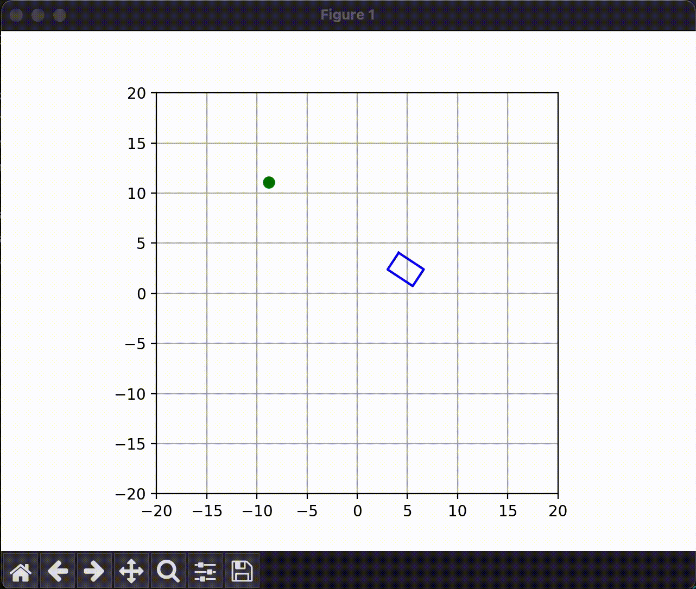

# Waypoint Following Vehicle

This project uses a simple global kinematic model for a skid steering vehicle and uses speed inputs to the left and right wheels to control yaw, speed, and position. A new waypoint is randomly generated every time the vehicle reaches the next one

$$
\begin{aligned}
v_{long} = \frac{1}{2}(v_{r} + v_{l}) \\
\dot{\psi} = \frac{1}{W} (v_{r} - v_{l}) \\
\dot{x} = v_{long}{\cos}({\psi}) \\
\dot{y} = v_{long}{\sin}({\psi})
\end{aligned}
$$

Where $v_r$ is the right wheel speed, $v_l$ is the left wheel speed, ${\psi}$ is the yaw angle, $x$ and $y$ are the global coordinates of the COM, and $W$ is the width of the vehicle.  

There are two PID controllers, one for speed and one for steering. The reference velocity is multiplied by a scalling factor to prevent large velocities when the vehicle is not facing in the direction of the target waypoint.

$$
\begin{aligned}
C = e^{-K|{\psi}_{error}|} \\
v_{ref} = Cv_{ref} \\
v_{error} = v_{ref} - v
\end{aligned}
$$

The reference is calculated by taking the arctangent of the position error between the current coordinates and target coordinates and the error is adjusted to be between $-{\pi}$ and ${\pi}$

$$
{\psi}_{ref} = {\tan}^{-1} \left( \dfrac{y_{ref} - y}{x_{ref} - x} \right) \\
$$

$$
{\psi}_{error} = {\psi}_{ref} - {\psi} \\
$$

$$
{\psi}_{error} = {\psi_{error}} - 2{\pi} \left\lfloor \dfrac{{\psi}_{error} + {\pi}}{2{\pi}} \right\rfloor 
$$

After computing the inputs $u_{speed}$ and $u_steer$ the inputs to $v_r$ and $v_l$ are calculated in the following way.

$$
\begin{aligned}
v_r = u_{speed} + 0.5Wu_{steer}\\
v_l = u_{speed} - 0.5Wu_{steer}
\end{aligned}
$$
